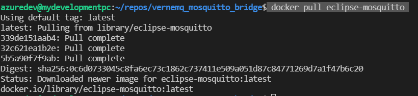

# Verne MQ to Mosquitto MQ : MQTT bridge configuration

In this exercise, we shall try to setup an mqttbridge that pulls data from verne mq to mosquitto mq

## Steps
- eclipse-mosquitto
    - pull eclipse-mosquitto

    - make con
- 
    - 