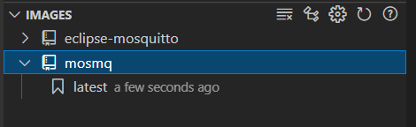
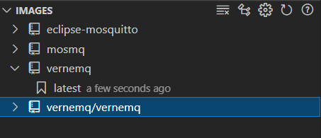
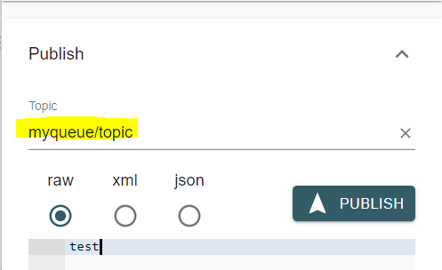
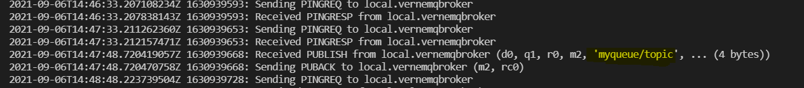

# Verne MQ to Mosquitto MQ : MQTT bridge configuration

In this exercise, we shall try to setup an mqttbridge that pulls data from verne mq to mosquitto mq

## Get mosquitto ready in docker
- make docker file
    ```dockerfile
    FROM eclipse-mosquitto
    WORKDIR /mosquitto/config
    
    COPY mosquitto.conf mosquitto.conf
    EXPOSE 1883 9000
    
    CMD ["/usr/sbin/mosquitto", "-c", "/mosquitto/config/mosquitto.conf"]
    ```
- make config file
    ```dockerfile
    listener 1883
    protocol websockets
    autosave_interval 60
    log_type information
    log_type notice
    log_type warning
    log_type error

    #Bridge
    connection vernemqbroker
    address 22.155.277.138:1884 #OR address yourpcname.westeurope.cloudapp.azure.com:1884
    topic # in 1
    bridge_protocol_version mqttv311
    bridge_insecure true
    cleansession true
    remote_clientid  vernemqbroker
    start_type automatic
    notifications true
    log_type all
    ```
## Get your vernemq ready in docker
- make docker file
    ```dockerfile
    FROM vernemq/vernemq:1.12.1
    WORKDIR /vernemq
    
    EXPOSE 1884
    ENV DOCKER_VERNEMQ_ACCEPT_EULA=yes
    ENV DOCKER_VERNEMQ_ALLOW_ANONYMOUS=on
    
    CMD ["start_vernemq"]
    ```
## Build
- Go to docker file location of mosquitto
- `docker build -t mosmq -f Dockerfile .`

- Go to docker file location of vernemq
- `docker build -t vernemq -f Dockerfile .`

## Run
- vernemq
    - `docker run --rm -it  -p 1884:1883/tcp vernemq:latest`
- mosquitto
    - `docker run --rm -it -p 1883:1883/tcp mosmq:latest`
## Verify
-  Using mqtt explorer, we can connect to vernemq. Once connected publish a message

- You may verify the data by pulling mosquito logs

